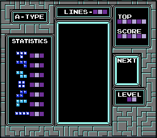

# Tetris Game (SFML C++)

A classic Tetris game implemented in C++ using the [SFML](https://www.sfml-dev.org/) graphics library. This project was developed as a PF-Project for Fall 2022.

## Features

- Classic Tetris gameplay with falling blocks
- Keyboard controls for movement and rotation
- Shadow piece to preview landing position
- Line clearing and scoring
- Game over detection
- Custom graphics and sprites

## Screenshots



## Getting Started

### Prerequisites

- C++ compiler (e.g., `g++`)
- [SFML library](https://www.sfml-dev.org/download.php) (Graphics, Window, System modules)

### Installation

1. **Clone the repository:**
    ```sh
    git clone https://github.com/yourusername/tetris-sfml.git
    cd tetris-sfml
    ```

2. **Install SFML:**
    - On Ubuntu:
        ```sh
        sudo apt-get install libsfml-dev
        ```
    - On Windows/Mac, follow [SFML installation guide](https://www.sfml-dev.org/tutorials/2.5/).

3. **Build and Run:**
    - Use the provided script:
        ```sh
        ./run.sh
        ```
    - Or compile manually:
        ```sh
        g++ -c -w main.cpp
        g++ main.o -o game -lsfml-graphics -lsfml-window -lsfml-system
        ./game
        ```

## Controls

- **Left Arrow:** Move piece left
- **Right Arrow:** Move piece right
- **Up Arrow:** Rotate piece
- **Down Arrow:** Accelerate piece drop

## Project Structure

```
.
├── main.cpp             # Main game loop and rendering
├── functionality.h      # Game logic (movement, rotation, line clearing, etc.)
├── pieces.h             # Tetris block definitions
├── utils.h              # Constants and utility functions
├── run.sh               # Build and run script
├── img/                 # Game graphics and sprites
│   ├── background.png
│   ├── blocksheet.png
│   ├── bomb.png
│   ├── frame.png
│   ├── gamescreen.png
│   ├── shadow.png
│   └── tiles.png
└── .vscode/             # VSCode settings
```

## Customization

- **Sprites:** You can replace images in the `img/` folder to change the appearance of blocks, background, etc.
- **Game Parameters:** Adjust grid size and other constants in [`utils.h`](utils.h).

## Acknowledgements

- [SFML](https://www.sfml-dev.org/) for graphics and window management.
- Inspired by classic Tetris.

## License

This project is open source and available under the [MIT License](LICENSE).

---

Enjoy Tetris ! Or sorry that happened to you :(